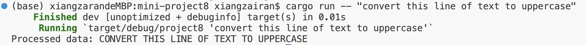
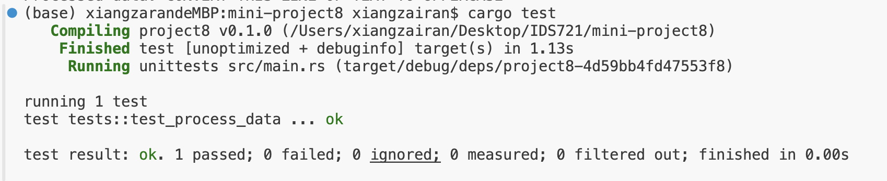

# Rust Command-Line Tool with Testing

This project serves as a utility for transforming text data to uppercase, and is structured to facilitate both direct use and testing.

# Requirements:
- Rust command-line tool (by using cargo run -- "some text here")
- Data ingestion/processing (by writing the functions in main.rs)
- Unit tests (also in main.rs)

## Core Funtionality
**1. Tool functionality**

It transforms all the text data to uppercase.



**2. Data ingestion/processing**

```rust
fn main() {
    let args: Vec<String> = env::args().collect();

    if args.len() < 2 {
        eprintln!("Usage: {} <input_string>", args[0]);
        std::process::exit(1);
    }

    let input_data = &args[1];
    let processed_data = process_data(input_data);

    println!("Processed data: {}", processed_data);
}

fn process_data(data: &str) -> String {
    data.to_uppercase().chars().collect()
}
```


**3. Testing implementation**
```rust

#[cfg(test)]
mod tests {
    use super::*;

    #[test]
    fn test_process_data() {
        assert_eq!(process_data("rust"), "RUST");
        assert_eq!(process_data("hello"), "HELLO");
        assert_eq!(process_data("world"), "WORLD");
        assert_eq!(process_data("this is a test"), "THIS IS A TEST");
    }
}
```




